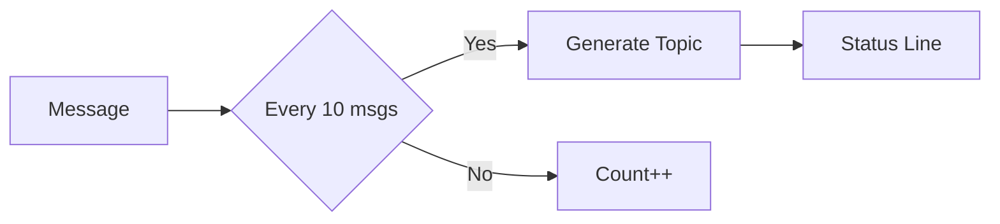

# Claude Session Topics

> *"What was I working on in that other terminal?"*

If you juggle multiple Claude Code sessions, you know the feeling. You switch tabs,
and suddenly you're staring at a wall of code with zero recollection of what you
were doing. This plugin fixes that.

**Claude Session Topics** generates concise, AI-powered topic summaries for your
Claude Code sessions. Topics appear in your status line, shell prompt, or wherever
you need them—so you can context-switch without the mental overhead.

For the full story behind this project, check out my blog post:
[Session Topic Summaries in Claude Code Status Line][blog-post].

## How It Works



Every message triggers the hook, but topic generation only fires every 10 messages
(configurable). The API call runs in the background—your hook returns in under 50ms.

## Example Topics

Topics follow `<theme>: <activity>` format with gerund (-ing) form:

```text
OAuth debug: fixing schema validation
Blog post: adding code snippets
API refactor: updating endpoints
```

## Quick Start

```bash
# Run inside Claude Code
/plugin marketplace add dreamiurg/claude-session-topics
/plugin install claude-session-topics@dreamiurg
```

The plugin automatically registers hooks. To display topics in your status line:

```bash
/claude-session-topics:setup-statusline
```

This command examines your current setup and offers to integrate topics with your
existing status line configuration.

## Configuration

All settings are environment variables:

| Variable | Default | Description |
|----------|---------|-------------|
| `CLAUDE_TOPIC_THRESHOLD` | `10` | Messages between regeneration |
| `CLAUDE_TOPIC_MAX_CHARS` | `50` | Max topic length |
| `CLAUDE_TOPIC_DEBUG` | `0` | Set to `1` for stderr logging |
| `CLAUDE_MEM_DB` | `~/.claude-mem/claude-mem.db` | Path to claude-mem DB |

## Context Sources

The plugin tries two sources in order:

1. **claude-mem** (preferred) — If you have [claude-mem][claude-mem] installed,
   we query its SQLite database for rich semantic context.

2. **Transcript** (fallback) — Parses Claude Code transcript for recent messages.

## Troubleshooting

**Topics not appearing?**

```bash
export CLAUDE_TOPIC_DEBUG=1  # Enable debug logging
```

**"waiting for conversation"** — Normal on fresh sessions. Clears after a few
messages when there's enough context.

## Requirements

- [Claude Code](https://claude.ai/code) CLI
- `jq` (JSON processor)
- `sqlite3` (optional, for claude-mem)
- Bash 4.0+

## License

[MIT](LICENSE)

---

*Built by [@dreamiurg](https://github.com/dreamiurg) because remembering context
shouldn't require context.*

[blog-post]: http://dreamiurg.net/2026/01/08/claude-code-session-topics.html
[claude-mem]: https://github.com/thedotmack/claude-mem
