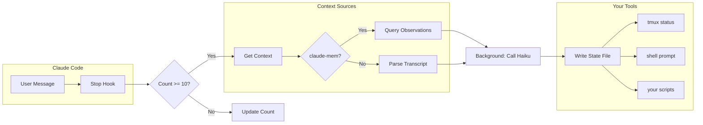
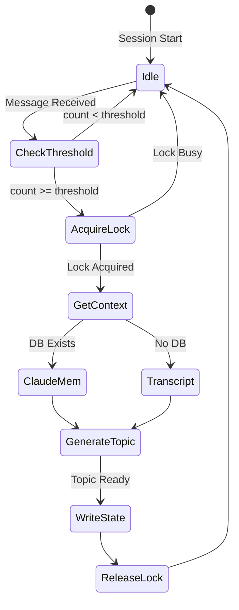

# Claude Session Topics

> *"What was I working on in that other terminal?"*

If you juggle multiple Claude Code sessions, you know the feeling. You switch tabs,
and suddenly you're staring at a wall of code with zero recollection of what you
were doing. This plugin fixes that.

**Claude Session Topics** generates concise, AI-powered topic summaries for your
Claude Code sessions. Topics appear in your status line, shell prompt, or wherever
you need them—so you can context-switch without the mental overhead.

For the full story behind this project, check out my blog post:
[Session Topic Summaries in Claude Code Status Line][blog-post].

## How It Works



The magic happens in the background. Every message triggers the hook, but topic
generation only fires every 10 messages (configurable). When it does, the actual
API call runs asynchronously—your hook returns in under 50ms while Haiku does its
thing.

## Example Topics

Topics follow a simple format: `<theme>: <activity>` with the activity in gerund
(-ing) form. This captures what's happening *right now*:

```text
OAuth debug: fixing schema validation
Blog post: adding code snippets
API refactor: updating endpoints
Session topics: writing README
```

## Quick Start

### Installation

```bash
# Add the marketplace
claude /marketplace-add https://github.com/dreamiurg/claude-session-topics.git

# Install the plugin
claude /plugin-install claude-session-topics
```

Or clone manually:

```bash
git clone https://github.com/dreamiurg/claude-session-topics.git \
  ~/.claude/plugins/claude-session-topics
```

### Configure Hooks

Add to your `~/.claude/settings.json`:

```json
{
  "hooks": {
    "Stop": [{
      "hooks": [{
        "type": "command",
        "command": "cat | ~/.claude/plugins/claude-session-topics/scripts/topic-generator"
      }]
    }],
    "SessionEnd": [{
      "hooks": [{
        "type": "command",
        "command": "cat | ~/.claude/plugins/claude-session-topics/scripts/session-cleanup"
      }]
    }]
  }
}
```

### Use the Topics

```bash
# Read topic for current session
./scripts/topic-display "$CLAUDE_SESSION_ID"
# Output: "OAuth debug: fixing auth flow (5m)"
```

The `$CLAUDE_SESSION_ID` environment variable is set automatically by Claude Code
for each session.

## Architecture Deep Dive



### State Management

Topics live in `$TMPDIR/claude-topic-<session_id>.json`:

```json
{
  "count": 5,
  "topic": "OAuth debug: fixing auth flow",
  "error": "",
  "generated_at": 1704067200
}
```

| Field | Description |
|-------|-------------|
| `count` | Messages since last generation (resets to 0 after) |
| `topic` | The generated topic, or empty if none yet |
| `error` | Error message like "waiting for conversation" |
| `generated_at` | Unix timestamp of last update |

### Context Sources

The plugin tries two sources in order:

1. **claude-mem** (preferred) — If you have [claude-mem][claude-mem] installed,
   we query its SQLite database for session observations. This provides rich,
   semantic context about what you've actually accomplished.

2. **Transcript** (fallback) — Parses raw Claude Code transcript for recent
   user/assistant messages. Works everywhere but has less semantic depth.

## Configuration

All settings are environment variables—no config files to manage:

| Variable | Default | What it does |
|----------|---------|--------------|
| `CLAUDE_TOPIC_THRESHOLD` | `10` | Messages between regeneration |
| `CLAUDE_TOPIC_MAX_CHARS` | `50` | Max topic length |
| `CLAUDE_TOPIC_CONTEXT_LINES` | `20` | Lines from transcript for fallback context |
| `CLAUDE_TOPIC_LOCK_TIMEOUT` | `60` | Seconds before stale lock is broken |
| `CLAUDE_TOPIC_MEM_LIMIT` | `5` | Max claude-mem observations to query |
| `CLAUDE_TOPIC_DEBUG` | `0` | Set to `1` for stderr logging |
| `CLAUDE_MEM_DB` | `~/.claude-mem/claude-mem.db` | Path to claude-mem DB |

## Integration Ideas

### tmux Status Line

```bash
# ~/.tmux.conf
set -g status-right "#(~/.claude/plugins/claude-session-topics/scripts/topic-display $CLAUDE_SESSION_ID)"
```

### Shell Prompt

```bash
# ~/.bashrc or ~/.zshrc
claude_topic() {
  [[ -n "$CLAUDE_SESSION_ID" ]] && \
    ~/.claude/plugins/claude-session-topics/scripts/topic-display "$CLAUDE_SESSION_ID"
}
PS1='$(claude_topic) $ '
```

## Troubleshooting

**Topics not appearing?**

```bash
# Enable debug logging
export CLAUDE_TOPIC_DEBUG=1

# Test manually
echo '{"session_id":"00000000-0000-0000-0000-000000000000"}' | ./scripts/topic-generator

# Check state
cat $TMPDIR/claude-topic-00000000-0000-0000-0000-000000000000.json
```

**"waiting for conversation"** — Normal on fresh sessions. Clears after a few
messages when there's enough context.

**Stale topics?** — Topics regenerate every `THRESHOLD` messages. Check for
stuck locks: `ls $TMPDIR/claude-topic-*.lock`

## Requirements

- [Claude Code](https://claude.ai/code) CLI
- `jq` (JSON processor)
- `sqlite3` (optional, for claude-mem)
- Bash 4.0+

## Contributing

See [CONTRIBUTING.md](CONTRIBUTING.md). PRs welcome!

## License

[MIT](LICENSE)

---

*Built by [@dreamiurg](https://github.com/dreamiurg) because remembering context
shouldn't require context.*

[blog-post]: http://dreamiurg.net/2026/01/08/claude-code-session-topics.html
[claude-mem]: https://github.com/thedotmack/claude-mem
